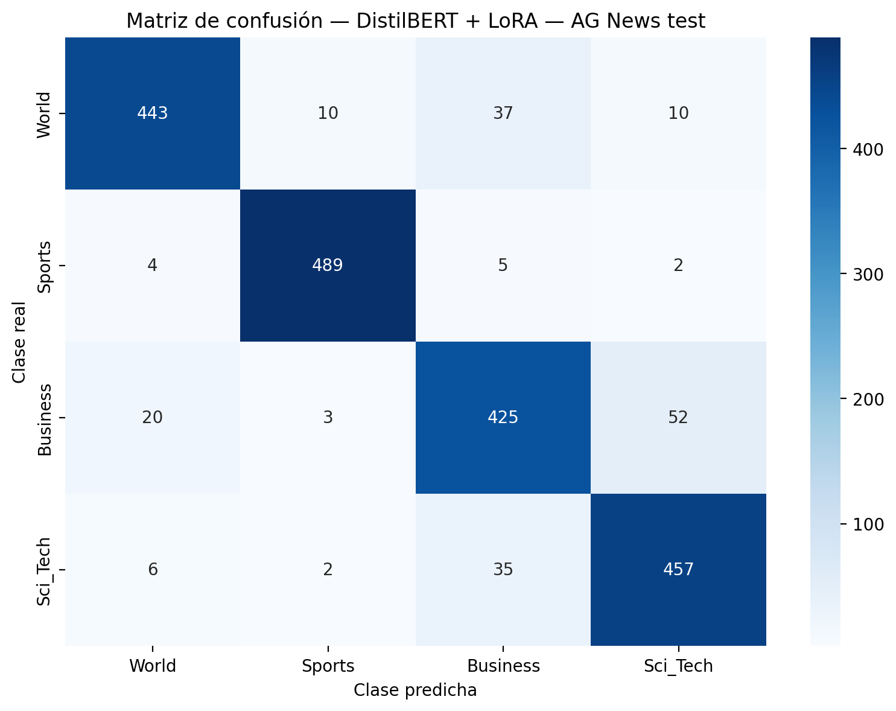

# Módulo 4 - Clasificación de noticias con DistilBERT + LoRA

Pre-entrega de **Data Scientist III**: fine-tuning eficiente de un Transformer para clasificación multiclase sobre **AG News**.

## Objetivo

Adaptar `distilbert-base-uncased` mediante **LoRA (Low-Rank Adaptation)** y comparar sus resultados con el baseline TF-IDF + LinearSVC del Módulo 3, utilizando el mismo conjunto de test de 2.000 noticias.

## Notebook

- [Ver el notebook completo en GitHub](Noero_Matias_LoRA_AGNews.ipynb)
- [Abrir la versión de trabajo en Google Colab](https://colab.research.google.com/drive/1Jw5T826e2VwWqBg1zdNeVPxtI1GifQKX)

El notebook incluye la instalación compatible para Colab, la preparación de AG News, el fine-tuning con LoRA, la evaluación sobre el test común y la exportación de resultados.

## Configuración principal

| Parámetro | Valor |
|---|---|
| Modelo base | `distilbert-base-uncased` |
| Rank LoRA | 8 |
| Alpha | 16 |
| Dropout | 0,1 |
| Target modules | `q_lin`, `v_lin` |
| Learning rate | 2e-4 |
| Épocas | 3 |
| Longitud máxima | 64 tokens |
| Hardware | GPU NVIDIA T4 |

Se entrenaron **741.124 de 67.697.672 parámetros**, equivalentes al **1,095%** del modelo.

## Datos

- Entrenamiento: 6.400 noticias.
- Validación: 1.600 noticias.
- Test común: 2.000 noticias.
- Clases: `World`, `Sports`, `Business`, `Sci_Tech`.

## Resultados

| Métrica | DistilBERT + LoRA |
|---|---:|
| Precision macro | 0,9076 |
| Recall macro | 0,9070 |
| F1 macro | 0,9070 |
| F1 weighted | 0,9070 |
| Accuracy | 0,9070 |

El modelo obtuvo **1.814 aciertos sobre 2.000 ejemplos**. Frente al baseline TF-IDF, mejoró el F1 weighted en **1,46 puntos porcentuales** y logró 29 predicciones correctas adicionales.

## Evidencia reproducible

- [Métricas completas](results/metrics_lora.json)
- [Reporte de clasificación](results/classification_report_lora.csv)
- [Historial de entrenamiento](results/training_history.csv)
- [Comparación con el baseline](results/model_comparison.csv)
- [Matriz de confusión](results/confusion_matrix_lora.png)
- [Descargar paquete original de resultados](Noero_Matias_LoRA_resultados.zip)

## Conclusión

LoRA permitió mejorar el desempeño del baseline entrenando poco más del 1% de los parámetros. La principal zona de confusión continuó siendo la frontera entre `Business` y `Sci_Tech`, donde se superponen vocabulario empresarial y tecnológico.

## Autor

**Matías Noero**
