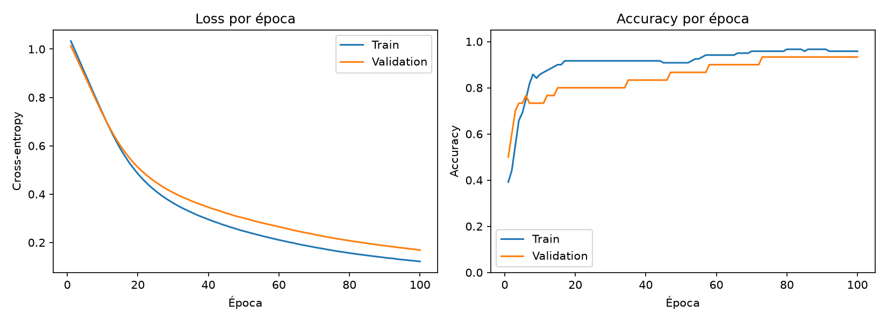
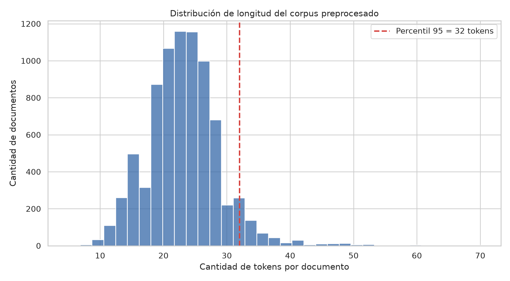
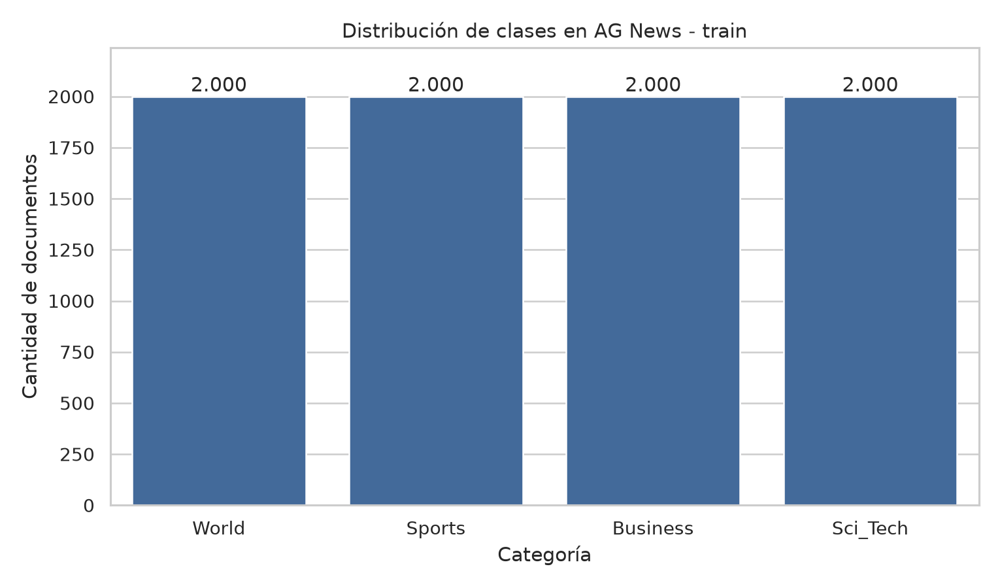
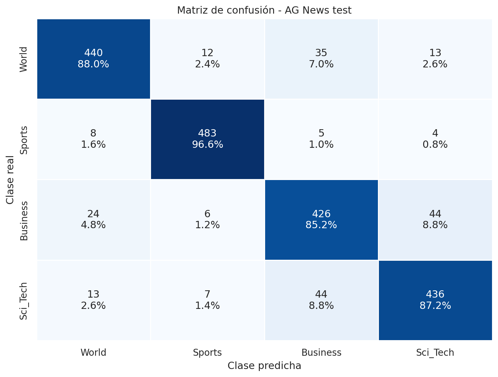

# Data Scientist III - NLP & Deep Learning

Repositorio central de proyectos y pre-entregas del curso **Data Science III**.

El trabajo sigue una cadena incremental: primero se construye una
infraestructura reproducible de entrenamiento y validación; luego se prepara un
corpus real de NLP; finalmente se desarrollarán un baseline TF-IDF y un
Transformer ajustado con LoRA para compararlos sobre el mismo conjunto de test.

## Proyectos

| Etapa | Proyecto | Objetivo | Resultado principal |
|---|---|---|---|
| Módulo 1 | [Pipeline base de Deep Learning](ds3_pipeline_base_1/) | Implementar entrenamiento y validación reproducibles con PyTorch sobre Iris | Accuracy de validación: **93,33%** |
| Módulo 2 | [Preprocesamiento y EDA de NLP](ds3_eda_nlp_modulo2/) | Limpiar, lematizar y diagnosticar AG News sin usar el test | P95: **32 tokens**; 4 clases balanceadas |
| Módulo 3 | [Clasificador supervisado con TF-IDF](ds3_tfidf_baseline_modulo3/) | Construir el baseline supervisado sobre el corpus del Módulo 2 | Accuracy: **89,25%**; F1 Macro: **0,8925** |
| Módulo 4 | Transformer con LoRA | Ajustar eficientemente un Transformer sobre el mismo corpus | Próximamente |
| Proyecto final | Comparación de modelos | Comparar TF-IDF y Transformer + LoRA sobre el mismo test | Próximamente |

## Módulo 1 - Pipeline de entrenamiento y validación

Se implementó una red neuronal multicapa en PyTorch sobre Iris, con:

- división estratificada train/validation;
- escalado ajustado exclusivamente con train;
- detección automática de CUDA, MPS o CPU;
- semillas para reproducibilidad;
- ciclos separados de entrenamiento y validación;
- registro de loss y accuracy por época.

[Ver proyecto y código](ds3_pipeline_base_1/)



## Módulo 2 - Pipeline de Preprocesamiento y Diagnóstico

Se trabajó con **AG News**, corpus de noticias en inglés con cuatro categorías.
El pipeline incluye limpieza Regex, normalización, tokenización, lematización
con SpaCy, análisis de frecuencias, n-gramas, longitudes y balance de clases.

Principales resultados:

- 8.000 documentos de entrenamiento;
- 2.000 documentos de test reservados;
- 2.000 documentos por categoría;
- mediana de 23 tokens;
- percentil 95 de 32 tokens;
- ningún documento vacío después del pipeline.

[Ver proyecto, código e informe](ds3_eda_nlp_modulo2/)





## Módulo 3 - Clasificador supervisado con TF-IDF

Se construyó un baseline reproducible de clasificación multiclase sobre AG News
utilizando `TfidfVectorizer` y un clasificador `LinearSVC`. La selección de
parámetros se realizó únicamente dentro del conjunto de entrenamiento para
evitar data leakage.

Principales resultados sobre 2.000 noticias de test:

- Accuracy: **89,25%**;
- F1 Macro: **0,8925**;
- mejor configuración: unigramas + bigramas y hasta 40.000 características;
- `Sports` fue la categoría más fácil de predecir;
- la mayor confusión se produjo entre `Business` y `Sci_Tech`.

[Ver proyecto, código y resultados](ds3_tfidf_baseline_modulo3/)



## Principios del proyecto

- **Reproducibilidad:** semillas, dependencias y parámetros documentados.
- **Prevención de data leakage:** los ajustes se realizan únicamente con train.
- **Trazabilidad:** se conservan resultados, métricas e informes.
- **Continuidad:** AG News será el corpus común de los Módulos 2, 3 y 4 y del
  Proyecto Final.
- **Comparabilidad:** los modelos se evaluarán sobre el mismo conjunto de test.

## Tecnologías

- Python
- PyTorch
- pandas y NumPy
- scikit-learn
- SpaCy
- Matplotlib y Seaborn
- Hugging Face Transformers y PEFT/LoRA en las próximas etapas

## Estructura del repositorio

```text
Data-Scientist-III/
├── ds3_pipeline_base_1/
│   ├── data/
│   ├── results/
│   ├── src/
│   └── README.md
├── ds3_eda_nlp_modulo2/
│   ├── data/
│   ├── reports/
│   ├── results/
│   ├── src/
│   └── README.md
├── ds3_tfidf_baseline_modulo3/
│   ├── data/
│   ├── results/
│   ├── src/
│   └── README.md
└── README.md
```

Cada proyecto posee sus propias instrucciones de instalación, ejecución y
reproducción de resultados.

## Autor

**Matías Noero**  
Analista de datos en formación continua hacia Data Science, NLP y Deep Learning.

